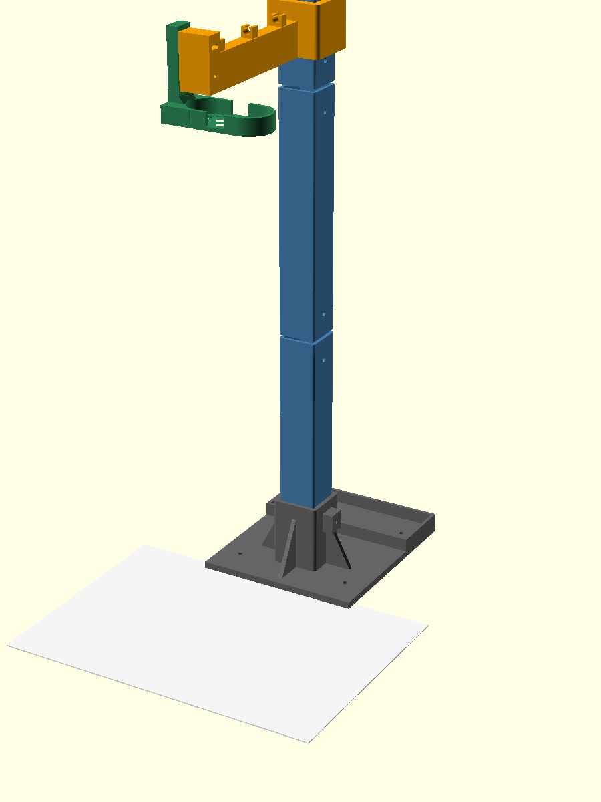
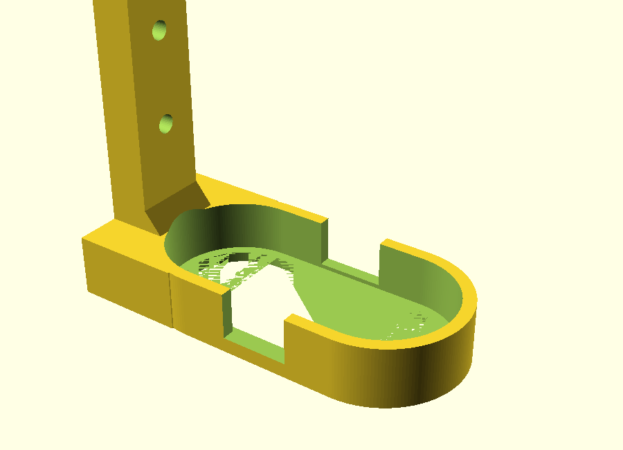
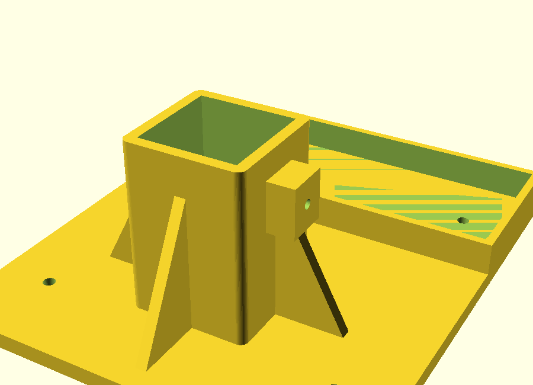

# A4 塗色掃描台 —— 攝影機支架

把 Logitech C270 架在桌面 A4 塗色紙正上方、鏡頭垂直向下的獨立式支架。
用 Bambu Lab A1 列印，全部零件免支撐，反覆拆裝免工具。



底座（放 A4 的部分）不含在這裡 —— 那一塊自己做，介面規格見下面「跟你的 A4 底座怎麼接」。

---

## 一、鏡頭要架多高：457 mm

**這個數字跟 `SETUP.md` 那張表不一樣，因為那張表算漏了兩件事。**

`SETUP.md` 的高度表是用「紙佔畫面**寬度** 80%」算的，而且把視角當成水平視角。
兩個前提對 C270 都不成立：

**（1）55° 是對角視角，不是水平視角。**
[Logitech 官方規格](https://www.logitech.com/en-us/shop/p/c270-hd-webcam)標的 55° 是對角。
C270 是 720p、16:9，換算回來：

```
對角比 = √(16² + 9²) = 18.358
tan(水平/2) = tan(27.5°) × 16/18.358 = 0.4537  →  水平視角 48.8°
tan(垂直/2) = tan(27.5°) ×  9/18.358 = 0.2552  →  垂直視角 28.6°
```

水平只有 48.8°，比表裡最窄的一欄還窄。

**（2）真正卡住的是垂直方向，不是水平方向。**
A4 橫式高 210 mm。紙佔畫面寬 80% 時，16:9 的畫面高只有 `297/0.8 × 9/16 = 208.8 mm`
—— 比紙還矮，上下會被切掉。

被切掉會出事，因為 `src/constants.js` 裡 `QR_AREA = {x:365, y:8, size:70}`，
換算後 **QR 上緣離紙張頂邊只有 3.0 mm**。四個定位方塊垂直只跨 186.4 mm 還在畫面內，
所以自動對位不會壞 —— 但 QR 被切掉，人物就自動判斷不出來。

所以取景要以「整張紙的高度都要進來」為準：

| 紙佔畫面高 | 鏡頭高度 | 紙佔畫面寬 | 評價 |
| --- | --- | --- | --- |
| 100% | 411 mm | 79.6% | 上下切齊，QR 會被切 |
| 95% | 433 mm | 75.6% | 有點緊 |
| **90%** | **457 mm** | **71.6%** | **設計工作點** |
| 85% | 484 mm | 67.6% | 保守，也很好 |
| 80% | 514 mm | 63.6% | 太高 |

`markerDetect` 的偵測下限（紙佔畫面寬 34%）換算成高度是 963 mm，
**從頭到尾都不是限制**。限制完全來自垂直方向和 QR。

C270 是固定焦距，太近會糊。457 mm 應該在景深內；預覽若偏軟就往上調，
484 mm 那一列同時改善對焦和取景餘裕。所以套環的行程做成 **380–520 mm** 可調。

改了 `src/constants.js` 的方塊尺寸或 QR 位置，就重跑
`node scripts/framing-check.js` 並回來重算這一節。

---

## 二、印什麼

### 最快的路：直接開 `3mf/` 裡的四塊板

`3mf/` 有四個排好的列印板，Bambu Studio 直接開，不用自己匯入排版：

| 檔案 | 內容 | 備註 |
| --- | --- | --- |
| `plate1-gauge.3mf` | 試裝規 ×1、試扣梳 ×1 | **先印這塊**，約 15 分鐘 |
| `plate2-foot-knobs.3mf` | 底座 ×1、旋鈕 ×6 | 最大件 |
| `plate3-masts.3mf` | 立柱 ×2、加長節 ×1 | **要加 brim** |
| `plate4-arm-cradle-plugs.3mf` | 臂 ×1、托架 ×1、接頭 ×2 | |
| `plate5-rework.3mf` | 接頭 ×2、旋鈕 ×2、試扣梳 ×1 | 只給已經照舊版印過一輪的人 |

`plate5-rework.3mf` 是補印板。用幾何比對（體積、外框、兩萬點佔用取樣）確認過
`foot` / `mast` / `mast_short` / `cradle` / `knob` / `gauge` 的形狀跟第一版**完全相同**，
不用重印；真正改過的只有 `plug`（螺帽袋 1.5 mm 修正）與 `arm`（扣線夾）。
`arm` 不放進補印板，因為要先用試扣梳量出 `cable_dia` 才值得重印 ——
而且線用魔鬼氈或束帶綁在臂上效果一樣，多半不必重印。

**這些 .3mf 只包幾何與擺放，不包列印參數** —— 線材、噴頭溫度、機器設定會沿用你
Bambu Studio 自己的 profile。這是刻意的：那些設定不該由我猜。開檔後只要照下面
「列印設定」把牆數、填充、支撐調好就能切片。

三根立柱刻意排在同一塊板上，不是為了省時間 —— 單獨印一根 35×35 的中空方管，
每層只有很短的一圈路徑，幾秒就跑完，塑膠來不及冷卻，成品會軟、層間也黏不牢。
三根一起印讓每層時間變三倍，品質差很多。如果你比較怕撞倒，也可以一根一根印，
但務必把層時間下限（或風扇冷卻）調上去。

`stl/` 裡是同樣的零件的單檔版本，要自己排版或改參數重印時用。

### 零件清單

| STL | 數量 | 擺放方向 | 備註 |
| --- | --- | --- | --- |
| `foot.stl` | 1 | 底板貼床（如模型） | 最大件，約 5 小時 |
| `mast.stl` | 2 | **直立**（如模型，220 mm 高） | 加 5 mm brim |
| `mast_short.stl` | 1 | 直立 | 加長節，C270 要用到 |
| `plug.stl` | 2 | 直立 | 立柱接頭 |
| `arm.stl` | 1 | 如模型（套環軸朝 Z、臂底貼床） | |
| `cradle.stl` | 1 | 如模型（擋唇貼床） | |
| `knob.stl` | **6** | 如模型 | 多印一兩顆備用 |
| `gauge.stl` | 1 | 如模型 | **先印這個**，約 10 分鐘 |
| `clipcomb.stl` | 1 | 如模型 | 試扣梳，量 USB 線徑用 |

**全部零件都不需要支撐。** 形狀是照著這個條件設計的
（插座是垂直管、肋的斜邊離水平 63°、補強是上小下大的楔形、束帶凹口開口朝上）。
切片時如果 A1 幫你自動打開支撐，關掉。

### 列印設定

| 項目 | 設定 | 為什麼 |
| --- | --- | --- |
| 材料 | **PETG**（PLA 也可以） | PETG 韌、不怕曬。PLA 在夾緊處長期會潛變，鎖緊的地方久了會鬆 |
| 層高 | 0.2 mm | `gauge` 可以用 0.28 拚快 |
| 牆數 | **4 圈** | 這些零件靠牆撐剛性，加牆比加填充有效得多 |
| 填充 | 15%（立柱 25%） | |
| 支撐 | **不要** | |

整組實體體積約 690 cm³；以上面的設定切片實際大約 400–500 g 線材，一捲 1 kg 綽綽有餘。

### 先印試裝規與試扣梳

`cam_h`（機身正面短邊）是**唯一沒有實測**的尺寸 ——
取自 Logitech 規格 31.91 mm，並用照片長寬比 2.2 反推 31.8 mm 交叉驗證。

`gauge.stl` 就是托架的環，10 分鐘印完。把 C270 放進去：

- **放得進去、四周有一點點縫** → 正確，往下印。縫是故意留的（單邊 0.75 mm），用泡棉雙面膠墊掉。
- **塞不進去** → 把 `camera-stand.scad` 的 `cam_h` 加大 1–2，重新輸出。
- **鬆到會晃很多** → `cam_h` 減小 1–2。

`clipcomb.stl` 是同樣的道理，用來定 USB 線的粗細。上面五個夾子分別對應線徑
2.5 / 3.0 / 3.5 / 4.0 / 4.5 mm。拿真的線一格一格試，挑「**推得進去、但拉不出來**」
那一格，把數字填回 `cable_dia` 再輸出 `arm.stl`。

Logitech 沒有公開 C270 的線徑，所以這個一定要實測。預設 3.6 是估的。

---

## 三、五金

| 品項 | 數量 | 用在哪 |
| --- | --- | --- |
| M4×25 內六角 | 2 | 底座夾緊、套環夾緊（壓進旋鈕裡，自攻進塑膠） |
| M4×20 內六角 | **4** | 立柱接頭（壓進旋鈕裡）。每個接頭要**兩顆** —— 下管一顆、上管一顆，只鎖一邊的話上面那節管子可以在接頭上自由轉動 |
| M4 螺帽 | **4** | 埋在接頭 `plug` 裡，每個接頭兩顆 |
| M4×30 內六角 | 2 | 托架↔臂（設定一次就不動，用六角扳手） |
| M4×12〜16 | 4 | 把底座鎖到你自己的 A4 底座（長度看你底座多厚） |
| 魔鬼氈帶 ~20 cm | 1 | 跨過攝影機背面固定 |
| 泡棉雙面膠 | 少許 | 貼在環內壁當墊片，吃掉間隙止晃 |

夾緊處**不用螺帽**，M4 直接自攻進塑膠，咬合長度 14–15 mm，手轉的力量綽綽有餘。
少三顆螺帽，組裝時也不會有零件掉出來滾到地上。

---

## 四、組裝

1. **旋鈕**：把 M4 螺絲從旋鈕頂面的六角袋壓進去（緊配，會卡住）。
   要更保險就滴一點瞬間膠。共 4 顆：底座 M4×25、套環 M4×25、兩個接頭各 M4×20。
2. **接頭**：把 M4 螺帽壓進 `plug` **兩端**的六角袋（每個接頭 2 顆，共 4 顆）。
   接頭一插進立柱，螺帽就被管壁擋住掉不出來了。
3. **立柱**：`mast` + 接頭 + `mast` + 接頭 + `mast_short`，
   每個接頭插到中央凸緣抵住為止，再從管外用旋鈕鎖緊。總高 572 mm。
4. **底座**：立柱插進 `foot` 的插座到底，旋鈕鎖緊。
   螺絲會把立柱頂到對面兩個內角 —— 三點定位，不會晃也不會轉。
5. **臂**：`arm` 從立柱頂端套下去，先不要鎖死。
6. **托架**：`cradle` 的立板貼上臂尖立板，用 2 顆 M4×30 鎖上。
   上面那顆孔是樞軸、下面那道是弧槽，**先不要鎖死**，留著調水平。


7. **攝影機**：把 C270 從**背面**放進托架的環裡，正面外緣坐在那圈 2.5 mm 擋唇上。
   魔鬼氈帶從兩個凹口穿過去跨住機身背面。縫太大就在環內壁貼一小條泡棉雙面膠。
8. **走線**：USB 線壓進臂上的三個扣線夾，再沿立柱往下走。

> **重量一定要走擋唇，不能走膠。**
> 1.5 m 的線吊在 75 g 的機身上會把它拉歪、而且會一直晃 —— 這正是最傷偵測的東西，
> 因為角點是逐幀重算的，晃動就是每幀跳動。線一定要固定在結構上，攝影機端完全不受力。
>
> 泡棉雙面膠只當墊片和止晃，**不是受力路徑**。膠萬一失黏，攝影機也只是鬆鬆掛著，
> 不會從 45 cm 高摔到桌上。反覆拆裝請用魔鬼氈 —— 泡棉膠撐不了幾次，
> 而且會在 C270 那個霧面塑膠上留殘膠（要用酒精擦）。

---

## 五、跟你的 A4 底座怎麼接



`foot` 底板上有 4 個 M4 沉頭孔，**孔距 110 × 110 mm**，沉頭做在底面（螺絲頭不會把底板墊高）。
以**紙的後緣**當基準，四個孔在後方 **20 mm 與 130 mm**、左右各離中線 55 mm。

底板前緣在紙的後緣再往後 10 mm —— **底板完全不壓到紙**。
壓到的話 6 mm 厚度會把紙的後緣墊高，整張紙變斜的。

要鎖在一起的話，你的底座要往紙的後方多延伸約 150 mm 蓋到底板。
不鎖也可以：`foot` 後方有一個配重槽，丟硬幣、墊圈或一小包沙進去就好。

算過傾覆：以底板前緣為支點，**配重槽空的時候就已經有 2.8 倍餘裕**
（傾覆側：攝影機 75 g + 托架 19 g 在前方 95 mm、臂 83 g 在前方 15 mm；
回復側：立柱約 270 g 在後方 55 mm、底座約 160 g 在後方 85 mm）。
配重是給小朋友撞到用的，放 200 g 會變成 5.5 倍。

### 你的底座設計要注意兩件事

我讀了 `src/markerDetect.js`，有兩個坑：

**1. 底座千萬不要用黑色或深色。**
偵測用的是**固定的絕對亮度門檻 90**（`markerDetect.js:67`），
在畫面四個象限裡找**最大的深色連通區塊**。深色底座會變成一塊跟定位方塊競爭的大深色區。
用**中灰或淺色** —— `scripts/framing-check.js` 驗證時用的桌面就是灰階 150。
淺灰、米白、白色都安全。支架本身也建議用淺色線材。

**2. 上緣不要做立板。**
QR 上緣離紙頂只有 3.0 mm。上緣只要有立板就會擋住 QR，或在 QR 上壓一道陰影 ——
門檻是絕對值，陰影是真的會讓它讀不到。只做左、右、下三邊，高度 3–5 mm；
或乾脆做四個角落的 L 形角片（順便解決 297×210 超過 A1 成型尺寸的問題）。

---

## 六、現場調校

1. **高度**：鬆開套環旋鈕上下滑，開 `control.html` 看預覽，
   調到整張 A4 上下都進得來、四周留一點空白（紙佔畫面高約 90%）。約在 457 mm。
2. **水平**：鬆開托架下面那顆 M4，繞上面那顆轉（±8°），讓紙的四邊在畫面裡對稱。
   歪掉不會算錯（homography 會拉正），但會浪費畫面。
3. **鏡頭對中**：不用管。角點逐幀重算，457 mm 高偏個 10 mm 完全無感。
   托架已經把鏡頭偏心的 17 mm 補進去了，光軸就在立柱軸心的鉛垂線上。
4. **燈光**：攝影機一定在紙正上方，這躲不掉，所以解法是燈光而不是結構 ——
   **兩盞燈從左右各約 45° 打**，不要頭頂一盞。臂做成 12 mm 寬的薄斷面就是為了這個：
   迎光面窄，投下的是一條淡線而不是一塊影子。

---

## 七、換攝影機或換印表機

所有可調數值集中在 `camera-stand.scad` 最上面。互相要對得上的尺寸（貼合面、鎖孔高度、
臂該架多高）全部是**互相推導**出來的，不是各寫各的 —— 改一個數字，其他會跟著跑。

常見的改法：

```bash
# 換一台視角比較廣的攝影機（例如水平 70°），高度會低很多
openscad -D 'part="arm"' -D 'lens_height=280' -o stl/arm.stl camera-stand.scad

# 機身尺寸不一樣
openscad -D 'part="cradle"' -D 'cam_w=80' -D 'cam_h=36' -D 'cam_lens_x=22' \
         -o stl/cradle.stl camera-stand.scad

# 印表機成型高度比較小，立柱切短一點多印幾節
openscad -D 'part="mast"' -D 'seg_len=180' -o stl/mast.stl camera-stand.scad
```

改完**一定要重跑自檢**（下一節）。上面那些推導關係會在改參數時抓出裝不起來的組合。

---

## 八、組裝指南（單頁 HTML）

`assembly-guide.html` 是把第三、四節做成可以拿手機邊看邊裝的版本：分步圖、
零件與五金可勾選、每一步為什麼要這樣做。圖片全部內嵌，單檔可攜、離線可看。

重新產生（改了幾何或步驟時）：

```bash
./render-steps.sh        # 依目前的模型重新渲染分步圖
python3 make-guide.py    # 去背、內嵌、輸出 assembly-guide.html
```

## 九、交接文件

| 檔案 | 給誰 |
| --- | --- |
| `PRINT-HANDOFF.md` | 要在本機列印補印板、並量出 USB 線徑的 session |
| `HANDOFF.md` | 要接手設計與實機驗收的 session |

## 十、自檢

```bash
sudo apt-get install openscad          # 只需要裝一次
pip install trimesh networkx           # 列印板驗證要用，沒裝就自動略過
./check.sh
```

會檢查三件事：

1. **每個零件**都能無警告算出來、是**單一實體**（不是散開的碎片）、塞得進 A1 的 256³。
2. **干涉**：用 CSG 交集算真實碰撞，不是用眼睛看預覽。
   包含對照組（證明測試不是在比空氣）和貼合驗證
   （往外挪 0.1 mm 要完全分開、往內壓 0.5 mm 要咬得到 —— 這樣才知道是真的貼平，
   而不是根本沒碰到）。

3. **扣線夾**：量 `clipcomb` 五個夾子的通道與開口寬度，確認每一個都「通道比線粗、
   開口比線細」—— 開口比線寬就完全扣不住。這支抓到過舊版的夾子（通道 6.5、開口 4.4，
   對 3–4 mm 的線來說開口比線還寬，等於一條開放的溝）。
4. **列印板**：把 `3mf/` 讀回來（用 trimesh，跟寫出去的是不同的程式碼路徑），
   驗每個零件貼床、在成型範圍內、同板不重疊、體積跟來源 STL 一致（確認轉檔沒把網格弄壞）、
   而且每個 STL 都有被排進某一塊板。

另外 `check-joint.py`（被 `check.sh` 呼叫）會**量匯出的網格**，確認立柱的螺絲孔
與接頭的螺帽袋在組裝後同軸。刻意不看 `.scad` 的算式 —— 孔位是同一條式子推出來的，
拿它驗自己是套套邏輯。這支抓到過接頭偏 1.5 mm 的錯（中央凸緣吃掉每端 1.5 mm 的
插入深度，但孔位寫死成距端點 20 mm），而 M4 螺絲進 M4 螺帽只有約 0.25 mm 的容許偏心。

改了排版就重跑 `python3 make-3mf.py` 再跑 `./check.sh`。

這幾項不是裝飾。開發過程中它們抓到的實錯包括：扣線夾的開口比電線還寬（完全扣不住）、底座的螺帽袋穿出外壁留下懸空碎片、
套環的夾緊孔往內鑽進立柱孔裡、托架立板跟環只有切線接觸（等於沒接上）、
兩片立板佔同一塊空間、攝影機機身跟臂本體打架、底板整片壓在紙上。
每一個都是印出來才會發現裝不起來的錯。

---

## 九、已知取捨

- **立柱要 3 節**（220 + 220 + 120 = 572 mm）。C270 的視角窄，457 mm 是必要高度，
  而 A1 的 Z 只有 256，一體成形不可能。3 節就是 2 個接頭，每個接頭都是潛在的鬆動點 ——
  所以接頭做到 80 mm 長（上下各插入 38）而且用螺絲鎖死，不是靠摩擦。
- **靜態撓度不是問題，晃動才是。** 算過：立柱 35×35 中空、壁厚 3，
  75 g 的攝影機在 150 mm 外，頂端靜態下垂只有 0.054 mm。
  真正要顧的是敲到會晃 —— 所以剛性花在接合面的密合度（深插槽 + 螺絲鎖死），
  而不是加粗材料。估算固有頻率約 30 Hz，撞一下很快就停，
  而系統本來就要等穩定約一秒才拍。
- **臂只有 12 mm 寬**，是為了少投一點影子而不是為了輕。
  就算做到 30 mm 寬，撓度也只是從 0.0075 mm 變成 0.003 mm ——
  完全沒差，但影子會粗一倍。
- **托架環故意做鬆 1.5 mm**。犧牲一點「一裝上去就緊」的手感，
  換取「`cam_h` 猜 31 或 33 都裝得上」。間隙用泡棉膠墊掉，重量走擋唇。
